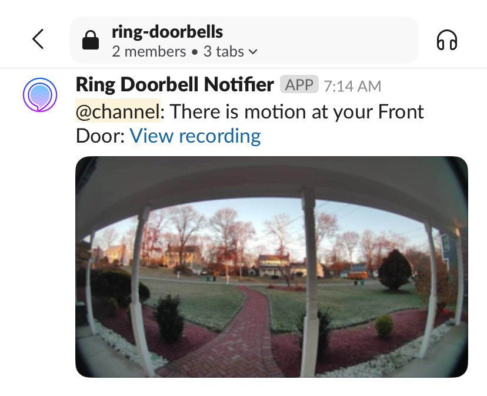

# Ring Doorbell Notifier
Simple, LLM/AI powered ([ollama](https://ollama.com) or [together-ai](https://api.together.ai)) nodejs app that will let you skip the expensive subscription and 
- Record your motion videos/snapshots directly on your **Mega drive**. Mega because it is the easiest and offers the best amount of free storage
- Send notification to **slack** with link to these videos when a motion is detected.
- Use AI to describe what your camera is seeing
- With this you can enjoy pretty much the same premium features of ring doorbells for totally FREE.


## How to run this locally
- The hardest part is to fill in the variables in `.env.sample` then rename it to `.env`.
- Run `npm install` then `npm start`

## How to run as a service using forever
- Install forever: `npm install forever -g`
- Run `npm run start-service`
- To stop the process: `npm run stop-service`
- To view running services: `npm run list-services`
By running as a service, the app would auto-restart in case of crash.

## How to run in docker (need docker desktop installed)
- Like the above, fill in the variables in `.env.sample` then rename it to `.env`.
- Run the following
```sh
docker build -t ring-doorbell-notifier .
docker run -d --restart always ring-doorbell-notifier 
```
- To create a linux build and push to dockerhub. You then can deploy it in a free host like [railway](https://railway.app/dashboard) or [render](https://dashboard.render.com). Replace your username and the tag (e.g. v1.2.0)
```sh
docker buildx build --platform linux/amd64 -t username/ring-doorbell-notifier:tag .
docker push username/ring-doorbell-notifier:tag
```

## How to get together-ai apikey
- Create an account with [together-ai](https://api.together.ai)

## How to install ollama vision models
- Install ollama: [Here](https://ollama.com/download/mac)
- Install the vision model of your choice
```sh
# Choose one of these
ollama pull llava:7b # fastest response but not always the best
ollama pull llama3.2-vision # best response but slowest
```
- Make sure you enable AI and set the model name in `.env` file
